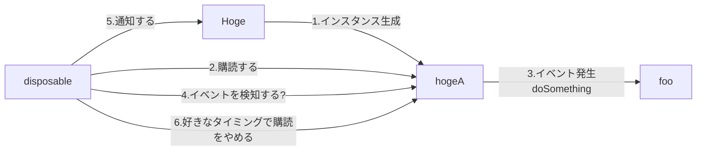
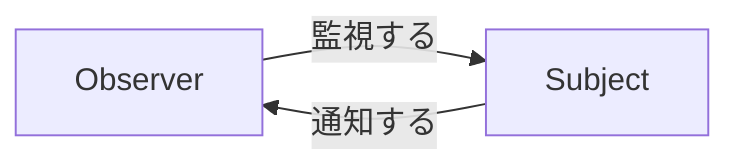

# はじめに

RxSwiftを整理するために書く。
以下の記事を参考に記載している。

- [What is LINQ](https://www.tutorialsteacher.com/linq/what-is-linq)
- []
- [Rxを使った設計をビジュアル化する](https://qiita.com/k5n/items/b8d2277cfe11f81111a7)
- [オブザーバーパターンから始めるRxSwift入門](https://qiita.com/k5n/items/17f845a75cce6b737d1e)
- [RxSwift の Observable とは何か](https://qiita.com/gomi_ningen/items/c796c08fe672610beecf#22-pull-%E5%9E%8B-observer-%E3%83%91%E3%82%BF%E3%83%BC%E3%83%B3)
- [ゼロからはじめるRxSwift（Swift4）](https://qiita.com/orimomo/items/3120aff12a06f0ab14e2)
- [アッテ開発の技術：Swift と RxSwift](https://speakerdeck.com/bricklife/atutekai-fa-falseji-shu-swift-to-rxswift?slide=54)
- [RxSwiftにおけるマルチスレッドの理解を深める — Schedulerについて](https://medium.com/eureka-engineering/rxswift%E3%81%AB%E3%81%8A%E3%81%91%E3%82%8B%E3%83%9E%E3%83%AB%E3%83%81%E3%82%B9%E3%83%AC%E3%83%83%E3%83%89%E3%81%AE%E7%90%86%E8%A7%A3%E3%82%92%E6%B7%B1%E3%82%81%E3%82%8B-scheduler%E3%81%AB%E3%81%A4%E3%81%84%E3%81%A6-2471ec76e518#:~:text=%E3%81%95%E3%81%84%E3%81%94%E3%81%AB-,Scheduler%E3%81%A8%E3%81%AF,%E3%81%8B%E3%82%92%E6%B1%BA%E3%82%81%E3%82%8B%E3%81%93%E3%81%A8%E3%81%A7%E3%81%99%E3%80%82)


# Rxとは

> Rxは、プッシュ型、つまり観測可能なコレクションを表すIObserver/IObservableというインターフェースのペアと、LINQ Standard Query Operatorsやその他の便利なストリーム変換機能を実装する拡張メソッドのライブラリで構成されています。（[Expert to Expert: Brian Beckman and Erik Meijer - Inside the .NET Reactive Framework (Rx)](https://www.youtube.com/watch?v=looJcaeboBY))

> RxはObservable<Element>インタフェースで表現される計算の汎用抽象化であり、Observableストリームから値やその他のイベントをブロードキャストしたり、サブスクライブしたりすることができます。([RXSwift](https://github.com/ReactiveX/RxSwift))


# Observableストリームとは

これがわかりやすい
- [アッテ開発の技術：Swift と RxSwift](https://speakerdeck.com/bricklife/atutekai-fa-falseji-shu-swift-to-rxswift?slide=54)


# RxSwift

# RxSiwftのイメージ

整理した結果、RxSwiftは、以下のようなフロー図になると思う。(たぶん)




# 宣言的と手続き型の違いを理解する

手続き型は、プログラミングを始める時に、紹介されているような書き方である。上から下に順に読みやすい。
宣言的は、数学の公式とかHTMLのような書き方である。全体のコード構成をイメージする必要がある。

```swift: 手続き型
a = 1
b = a + 1
a = 2
// aに値を代入しても、bは2のままである。
```

```swift: 宣言的
a = 1
b = a + 1
a = 2
// aに値を代入したら、bは同期的に3になる
// 同期的なので、開発時は、全体を把握する必要がある
```

RxSwiftは、「宣言的」な書き方に分類される。

# ストリームを理解する

ストリームを生成する
ストリームを加工する
ストリームを監視する

# RxSwiftはObserverパターンを用いる

> Observer パターン（オブザーバー・パターン）とは、プログラム内のクラスインスタンスで起きたイベント（事象）を、他のクラスインスタンスへ通知する処理で使われる、デザインパターンの一種。（引用先 [wikipedai](https://ja.wikipedia.org/wiki/Observer_%E3%83%91%E3%82%BF%E3%83%BC%E3%83%B3))

通知する側は`Subject`、通知される側は`Observer`と呼ばれます。他に、`Subject`を監視される側、`Observer`を監視する側と表現されることもある




先ほどの、宣言的の公式に当てはめると以下のようなイメージになる。

```swift: 宣言的
a = 1
b = a + 1 // bは、Observer
a = 2 // aは、Subject
// aに値を代入したら、bは同期的に3になる
// aが2であることを、bは監視していると言える
// または、aは、bに自身が2であることを通知しているとも言える
```

前提条件として、`Subject`は通知するアクションを行う前に、事前に`Observer`を自身に登録する必要がある。なぜなら、`Subject`は、通先先を把握していないから。（登録することを、Observer パターンでは、購読すると表現される？）

# Subjectの実装するには、Observableを用いる

RxSwiftの世界では、`Subject`を実装するには、`Observable`クラスが提供している`subscribe`を使う

```swift: Observerな役割を持つクラスHoge
class Hoge {
    // ObservableでHogeは、Subjectに自身の通知先を教えることができる
  var event: Observable<Int> {
    // 略
  }
  // ...
```

```swift: Subjectな役割を持つ変数disposable
// Subjectは、subscribe（購読）でHogeの通知先を把握できるようになった
let disposable = hoge.event.subscribe(
  onNext: { value in
    // 通常イベント発生時の処理
  },
  onError: { error in
    // エラー発生時の処理
  },
  onCompleted: {
    // 完了時の処理
  }
)
```

# PublishSubjectでイベントを発生

先ほどの、コードでは`Subject`は、イベントの通知ができるようになった。
ただ、イベントの発生がないため、通知ができない。
イベントの発生をさせるためには、`PublishSubject`を用いる

```swift: Observerな役割を持つクラスHogeにイベント発生のためのメソッドをもたせる
class Hoge {
    // イベント発生ができるようにする。privateでカプセル化させる
    private let eventSubject = PublishSubject<Int>()

    // PublishSubjectは、Observableでありつつ、イベント発生のためメソッドを持つ
    var event: Observable<Int> { return eventSubject }

    // このメソッドが叩かれると、イベントが発行され、Subjectは、通知できるようにする
    func doSomething() {
    // 略
    eventSubject.onNext(1)  // イベント発行
  }
}
```


# Schedulerとは

- マルチスレッドで処理を行う際に、重要な知識

# observeOn

# subscribeOn

`subscribeOn`は参照するストリームの元となるObservableの実行スレッドとそれに続くメソッドのスレッドを決定します。

スレッドを決定します？


```swift:

```

# ObservableType


# たとえば、

```swift:

someBoservable.


```

# why use rx?

* Rx を使用すると、宣言的な方法でアプリを構築できます。

## サンプル

```swift: Bindings
Observable.combineLatest(firstName.rx.text, lastName.rx.test) {$0 + " " + $1}
.map { "Greetings, \($0)" }
.bind(to: greetingLabel.rx.text)
```
1. 引数に入れる値を`Observable`型にする
2. combineLatestする要素を引数にいれる
3. 表現したい結果を`{$0 + " " + $1}`で表現する
4. `greetingLable`にbindする

```swift: viewModel
viewModel
    .rows
    .bind(to: resultsTableView.rx.items(cellIdentifier: "WikipediaSearchCell", cellType: WikipediaSearchCell.self)) { (_, viewModel, cell) in
        cell.title = viewModel.title
        cell.url = viewModel.url
    }
    .disposed(by: disposeBag)
```

## 再試行

```swift: retry
doSomthingIncredible("me")
.retry(3)
```

## Delegates

```swift:
public func scrollViewDidScroll(scrollView: UIScrollView) { [weak self] // what scroll view is this bound to?
    self?.leftPositionConstraint.constant = scrollView.contentOffset.x
}
```

```swift: 
self.resultsTableView
    .rx.contentOffset
    .map { $0.x }
    .bind(to: self.leftPositionConstraint.rx.constant)
```


# the basics, getting started with RxSwift
# traits - what are Single, Completable, Maybe, Driver, and ControlProperty ... and why do they exist?
# testing
# tips and common errors
# debugging
# the math behind Rx
# what are hot and cold observable sequences?


# 参考資料

- [Rxを使った設計をビジュアル化する](https://qiita.com/k5n/items/b8d2277cfe11f81111a7)
- [オブザーバーパターンから始めるRxSwift入門](https://qiita.com/k5n/items/17f845a75cce6b737d1e)
- [RxSwift の Observable とは何か](https://qiita.com/gomi_ningen/items/c796c08fe672610beecf#22-pull-%E5%9E%8B-observer-%E3%83%91%E3%82%BF%E3%83%BC%E3%83%B3)
