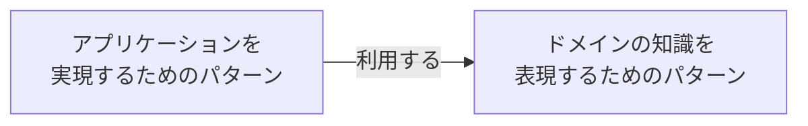

> ドメイン駆動設計のコンセプトは、ビジネスの問題を解決するためにビジネスの理解を深め、ビジネスの表現する。ビジネスとコードを結びつけて継続的かつ反復的な改良を施せるような枠組みを作ることにより、ソフトウェアをより役立つものにしようというものです。
（成瀬 2022、p4）


# はじめに

値オブジェクトについて、整理するためにこの記事を書く。

# 前提知識

ドメイン駆動設計には、「アプリケーションを実現するためのパターン」と「ドメインの知識を表現するためのパターン」の2つが存在する。それぞれ、以下のような関係性がある。



# 値オブジェクトの立ち位置

「値オブジェクト」は、「ドメインの知識を表現するパターン」として使われる。

「ドメインの知識を表現するパターン」には、「値オブジェクト」の他に、「集約」「ドメインサービス」「エンティティ」「仕様」と呼ばれるパターンがある。

「値オブジェクト」は、その中で基本のパターンとして扱われている。

# 値オブジェクトとは

値オブジェクトは、値の性質である「**不変**」「**交換可能**」「**等価性による比較**」をオブジェクトに適用することで、以下の効果をコードにもたらし、「システム固有の値」を作ることを期待されている

- 値で定義するよりも、表現力が増加する
- バリデーションを値オブジェクトに書くことで、不正な値を存在させない
- 型定義によって、誤った代入を防ぐ
- 共通化によって、ロジックの散財の防ぐ

# 「値」と「値オブジェクト」の違い

コードで書くと、以下の違いになる。

```c#:値
var fullName = "uzumaki naruto"
```

```c#:値オブジェクト
class FullName
[
    public FullName(string firstName, string lastName)
    {
        FirstName = firstName;
        LastName = lastName;
    }

    public string FirstName { get }
    public string LastName { get }
]
```

値はプリミティブ型で、値オブジェクトはクラスである、と言いたいわけではない。

値は、「姓」と「名」に、前後関係、依存性をもたらし、値オブジェクトは並列関係、独立性をもたらすことが言いたい。

並列関係にすることで、「姓」と「名」を同等に扱うことができ、呼び出しがシンプルになる、かつ、仕様変更にも対応しやすい。（この場合だと、外国人の名前の対応がわかりやすい）


```c#:値の「姓」のみを呼び出す時
var fullName = "uzumaki naruto"
var tokens = fullName.Split{" "}
var lastName = tokens[0]
Console.WirteLine(lastName)
```

```c#:値オブジェクトの「姓」のみを呼び出す時
var fullName = new FullName("uzumaki","naruto")
Console.WirteLine(fullName.LastName)
```

# 値の性質を値オブジェクトに適用する

値には、以下の3つの性質がある。この性質を、値オブジェクトに適用することで、ドメイン知識の表現に近づくことができる。
- 不変である
- 交換が可能である
- 等価性によって比較される

### 不変である

そのままの意味である。"Hello"は、"こんにちは"ではない。0は1ではない。
この性質を値オブジェクトに適用すると、以下のコードはNGになる。
なぜなら、不変であるべき値オブジェクトに自身の値を変更させるメソッドを定義しているからだ。

```c#:値オブジェクトのNGコード
var fullName = new FullName("uzumaki","naruto")
fullName.ChangeLastName("namikaze")
```

不変のメリットとデメリットは以下の通りだ

- メリット
  - キャッシュの再利用、並行・並列処理が容易になる
- デメリット
  - 値を一部変更させると、新たなインスタンスを生成する必要がある。つまり、パフォーマンス的に悪い。


### 交換が可能である

値オブジェクトは不変であるべきだが、現実問題厳しいときがある。
その場合は、代入で見せかけの「値の変更」をおこなう。

```c#:値オブジェクトの変更方法
var fullName = new FullName("uzumaki","naruto")
fullName = new FullName("namikaze", "naruto")
```

### 等価性によって比較される

値は、値自身ではなく、値を構成している属性で比較されている

```c#:値の比較
Console.WriteLine(0 == 0);
```

値オブジェクト同士で、行いたいときは、自前で比較メソッドを実装する。
値オブジェクトの値で比較はコード上で可能だが、値オブジェクト自身を値として扱いたいので、NGとする。

```c#:値オブジェクト同士で比較するためのメソッドを実装
class FullName : IEquatable<FullName>
{
    public FullName(string firstName, string lastName)
    {
        FirstName = firstName;
        LastName = lastName;
    }

    public string FirstName {get;}
    public string LastName {get;}

    public bool Equals(FullName other)
    {
        if(ReferenceEquals(null,other))return false;
        if(ReferenceEquals(this,other))return true;
        returnstring.Equals(FirstName,other.FirstName) && string.Equals(LastName,other.LastName);
    }

    public override bool Equals(object obj)
    {
        if(ReferenceEquals(null,obj))return false;
        if(ReferenceEquals(this,obj))return true;
        if(obj.GetType()!=this.GetType())return false;
        returnEquals((FullName)obj);
    }
}
```

```c#:値オブジェクト同士の比較はOK
var nameA = new FullName("uzumaki", "naruto");
var nameB = new FullName("uchiha", "sasuke");

var compareResult = nameA.Equals(nameB);
```

```c#:値オブジェクトから属性を取り出し比較はNG
var nameA = newFullName("masanobu","naruse");
var nameB = newFullName("john","smith");
var compareResult = nameA.FirstName == nameB.FirstName && nameA.LastName == nameB.LastName;
Console.WriteLine(compareResult);
```

# ふるまいを値オブジェクトに持たせる

- 値オブジェクトに、オブジェクトに対する操作をふるまいとして、まとめる
- ルール違反した操作は例外処理などで弾くようにする
- オブジェクトができるふるまいとできないふるまいを見極める必要がある（例：お金は加算できるが、乗算はできないなど）

```c#:値オブジェクトMoneyにAddというふるまいを持たせた
class Money
{
    private readonly decimal amount;
    private readonly string currency;

    public Money Add(Money arg)
    {
        if (arg == null) throw new ArgumentNullException(nameof(arg));
        if (currency != arg.currency) throw new ArgumentException($"通貨単位が異なります（this:{currency}, arg:{arg.currency}）");

        return new Money(amount + arg.amount, currency);
    }
}
```


## 参考

- [成瀬允宣（2020）「ドメイン駆動設計入門 ボトムアップでわかる! ドメイン駆動設計の基本」、翔泳社](https://www.amazon.co.jp/%E3%83%89%E3%83%A1%E3%82%A4%E3%83%B3%E9%A7%86%E5%8B%95%E8%A8%AD%E8%A8%88%E5%85%A5%E9%96%80-%E3%83%9C%E3%83%88%E3%83%A0%E3%82%A2%E3%83%83%E3%83%97%E3%81%A7%E3%82%8F%E3%81%8B%E3%82%8B-%E3%83%89%E3%83%A1%E3%82%A4%E3%83%B3%E9%A7%86%E5%8B%95%E8%A8%AD%E8%A8%88%E3%81%AE%E5%9F%BA%E6%9C%AC-%E6%88%90%E7%80%AC-%E5%85%81%E5%AE%A3/dp/479815072X)