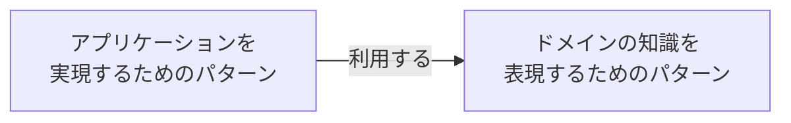

> ドメイン駆動設計のコンセプトは、ビジネスの問題を解決するためにビジネスの理解を深め、ビジネスの表現する。ビジネスとコードを結びつけて継続的かつ反復的な改良を施せるような枠組みを作ることにより、ソフトウェアをより役立つものにしようというものです。
（成瀬 2022、p4）

# はじめに

値オブジェクトについて、整理するためにこの記事を書く。

# 前提知識

ドメイン駆動設計には、「アプリケーションを実現するためのパターン」と「ドメインの知識を表現するためのパターン」の2つが存在する。それぞれ、以下のような関係性がある。

# エンディティの立ち位置

「エンディティ」は、「ドメインの知識を表現するパターン」として使われる。

「ドメインの知識を表現するパターン」には、「エンディティ」の他に、「値オブジェクト」「集約」「ドメインサービス」「仕様」と呼ばれるパターンがある。

「エンディティ」は、「値オブジェクト」と対を為すドメインオブジェクトとして紹介されている

# エンティティとは

ドメインモデルを実装したドメインオブジェクト。「値オブジェクト」とは違い、同一性が担保する存在がエンティティにはある

# 参考

- [成瀬允宣（2020）「ドメイン駆動設計入門 ボトムアップでわかる! ドメイン駆動設計の基本」、翔泳社](https://www.amazon.co.jp/%E3%83%89%E3%83%A1%E3%82%A4%E3%83%B3%E9%A7%86%E5%8B%95%E8%A8%AD%E8%A8%88%E5%85%A5%E9%96%80-%E3%83%9C%E3%83%88%E3%83%A0%E3%82%A2%E3%83%83%E3%83%97%E3%81%A7%E3%82%8F%E3%81%8B%E3%82%8B-%E3%83%89%E3%83%A1%E3%82%A4%E3%83%B3%E9%A7%86%E5%8B%95%E8%A8%AD%E8%A8%88%E3%81%AE%E5%9F%BA%E6%9C%AC-%E6%88%90%E7%80%AC-%E5%85%81%E5%AE%A3/dp/479815072X)